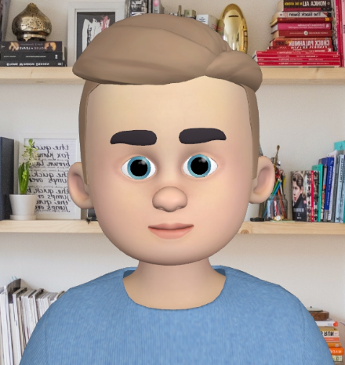

# Shopping-Cart-React
Multiple react web pages that can simply add and remove products to the database

<p></p>


## Description

Project aims to create a Shopping Cart App.


## Project Skeleton

```
Shopping Cart (folder)
|
SOLUTION
├── public
│     └── index.html
├── src
│    ├── assets
│    │       └── [images]
│    ├── components
│    │    ├── CardTotal.jsx
│    │    ├── MyNavbar.jsx
│    │    ├── ProductCard.jsx
│    │    └── Slider.jsx
│    └── pages
│        ├── About.jsx
│        ├── Main.jsx
│        ├── NewProduct.jsx
│        ├── ProductList.jsx
│        └── UpdateProduct.jsx
│    ├── router 
│        └── AppRouter.jsx
│    ├── App.js
│    ├── index.css
│    ├── index.js
│    ├── .gitignore
│    ├── LICENSE
├── package-lock.json
├── package.json
└── README.md


```

## Expected Outcome


## Objective

Build a Shopping Cart App using ReactJS.

### At the end of the project, following topics are to be covered;

- HTML

- CSS

- JS

- ReactJS

### At the end of the project, you will be able to;

- improve coding skills within HTML & CSS & JS & ReactJS.

- use git commands (push, pull, commit, add etc.) and Github as Version Control System.

## Steps to Solution

- Step 1: Create React App using `npx create-react-app shopping-cart`

- Step 2 : Install `"react-icons"` package to your `package.json` for icons or fontawesome cdn link paste to "public/index.html", install `axios` package and `react-router-dom`.

- Step 3: Build Checkout Page App.

- Step 4: You can use CSS frameworks like Bootstrap, Material UI etc.


## Notes

- Watch the video and follow the steps to create an account and project on MockAPI.

## Demo
  <a href="https://shopping-cart-mockapi.vercel.app/" target="_blank">Shopping Cart</a>


## How do we create mockApi? Watch the video!
<a href="https://www.youtube.com/watch?v=i_Gvlp83GMk" target="_blank">
 Watch the video
</a>
